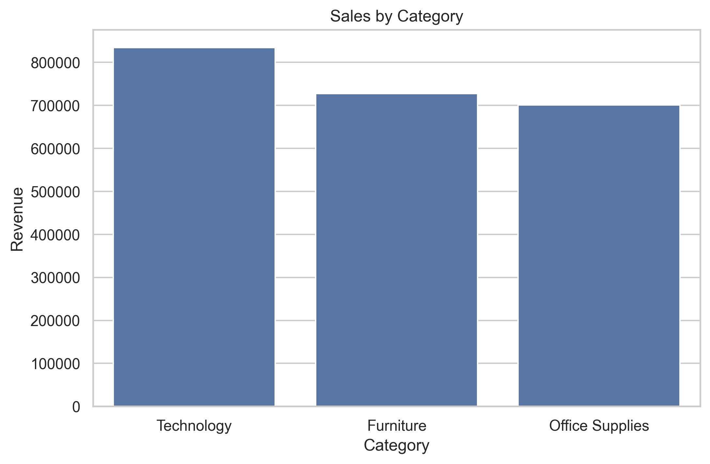
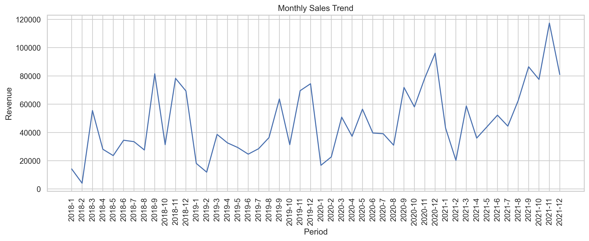
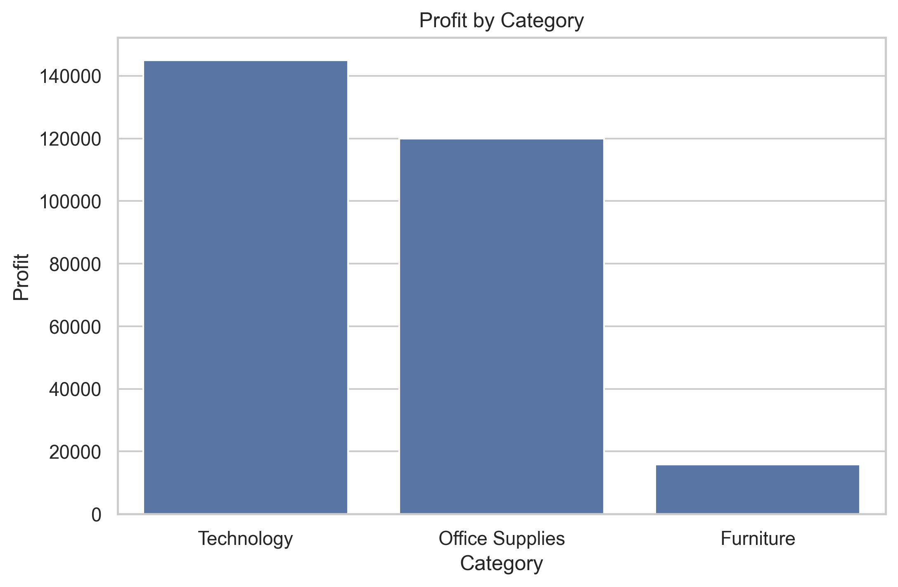
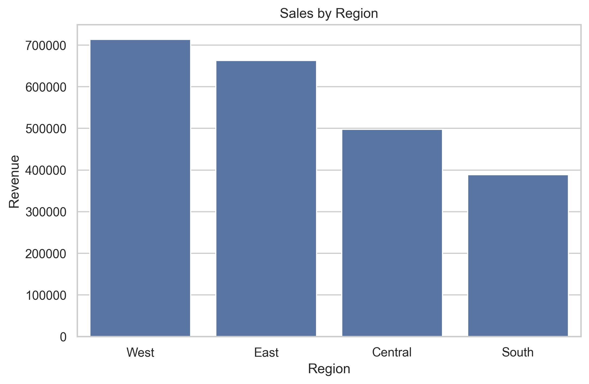

# 📊 Retail Sales Business Analysis using SQL & Python

An end-to-end data analytics project that analyzes retail sales data using **MySQL** for business analysis and **Python** for data visualization. The project uncovers valuable insights into sales performance, profitability, customer behavior, and regional trends to support data-driven business decisions.

---

## 📖 Project Overview

This project demonstrates how SQL and Python can be combined to analyze retail sales data and answer key business questions. The analysis helps identify top-performing products, profitable categories, regional trends, customer purchasing behavior, and monthly sales performance.

---

## 🛠️ Tech Stack

- **Database:** MySQL
- **Query Language:** SQL
- **Programming Language:** Python
- **Libraries:** Pandas, Matplotlib, Seaborn, OpenPyXL
- **Environment:** Jupyter Notebook

---

## 📂 Project Structure

```
Retail-Sales-Business-Analysis/
│
├── charts/
│   ├── category_sales.png
│   ├── monthly_sales_trend.png
│   ├── profit_by_category.png
│   └── region_sales.png
│
├── dataset/
│   └── superstore.xlsx
│
├── notebook/
│   └── data_visualization.ipynb
│
├── sql/
│   └── retail_sales_analysis.sql
│
├── README.md
└── requirements.txt
```

---

# 📊 Dataset

The project uses the **Sample Superstore Dataset**, containing **9,994 retail transactions** with the following information:

- Order Details
- Customer Information
- Product Details
- Category & Sub-Category
- Sales
- Profit
- Quantity
- Discount
- Region
- State
- Order Date

---

# 🔍 Business Questions Answered

This project answers several business questions using SQL.

### Sales Analysis

- Total Sales
- Total Orders
- Total Customers
- Sales by Category
- Sales by Region
- Sales by Segment
- Monthly Sales Trend

### Customer Analysis

- Top 10 Customers by Revenue

### Regional Analysis

- Top 10 States by Sales
- Sales by Region

### Profit Analysis

- Total Profit
- Profit by Category
- Top 10 States by Profit
- Profit by Sub-Category

### Product Analysis

- Top 10 Products by Units Sold

### Discount Analysis

- Average Discount by Category
- Sales by Discount

---

# 📈 Visualizations

## Sales by Category



**Insight**

- Technology generated the highest revenue.
- Furniture ranked second.
- Office Supplies maintained steady sales.

---

## Monthly Sales Trend



**Insight**

- Sales fluctuate across months with noticeable seasonal peaks.
- Overall sales show an upward trend over time.

---

## Profit by Category



**Insight**

- Technology generated the highest profit.
- Office Supplies delivered strong profitability.
- Furniture recorded relatively low profit despite high sales.

---

## Sales by Region



**Insight**

- West region generated the highest sales.
- East followed closely.
- South recorded the lowest sales.

---

# 💡 Key Business Insights

- Technology is the highest-performing category in terms of both revenue and profit.
- Furniture has strong sales but comparatively lower profit margins.
- The West region contributes the largest share of overall sales.
- Monthly sales exhibit seasonal fluctuations with strong year-end performance.
- A small group of customers contributes significantly to total revenue.
- Some product sub-categories consistently generate lower profits.

---

# 📌 Business Recommendations

- Increase investment in Technology products.
- Optimize pricing and discount strategies for Furniture.
- Replicate successful sales strategies from the West region in other regions.
- Prepare inventory ahead of peak sales periods.
- Strengthen customer loyalty initiatives for high-value customers.
- Review low-profit products for pricing or inventory optimization.

---

# 🚀 Getting Started

### 1. Clone the repository

```bash
git clone https://github.com/yourusername/Retail-Sales-Business-Analysis.git
```

### 2. Navigate to the project folder

```bash
cd Retail-Sales-Business-Analysis
```

### 3. Install dependencies

```bash
pip install -r requirements.txt
```

### 4. Import the dataset into MySQL

Create a database named:

```
superstore_analysis
```

Import the dataset from:

```
dataset/superstore.xlsx
```

### 5. Run SQL Analysis

Execute:

```
sql/retail_sales_analysis.sql
```

### 6. Run Python Notebook

Open:

```
notebook/data_visualization.ipynb
```

Update the MySQL connection credentials in the notebook before running it.

---

# 🧠 Skills Demonstrated

- SQL
- MySQL
- Python
- Data Cleaning
- Exploratory Data Analysis (EDA)
- Data Visualization
- Business Analytics
- Business Insight Generation
- Reporting

---

# 📈 Future Improvements

- Build an interactive Power BI dashboard.
- Develop a Streamlit web application.
- Perform customer segmentation using RFM analysis.
- Implement sales forecasting using Machine Learning.
- Create an executive KPI dashboard.

---

## ⭐ If you found this project useful, consider giving it a star!
